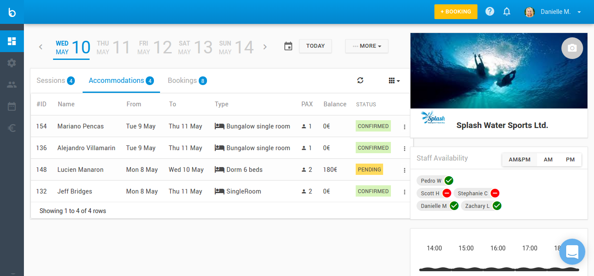
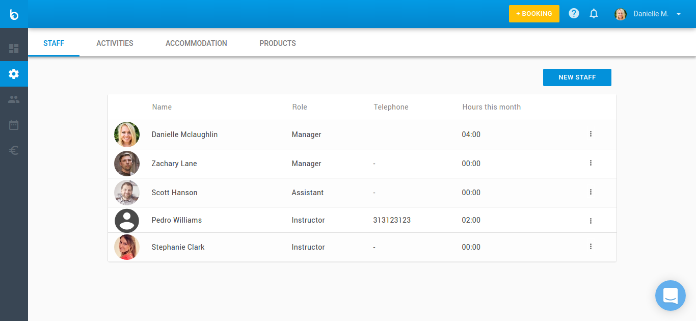
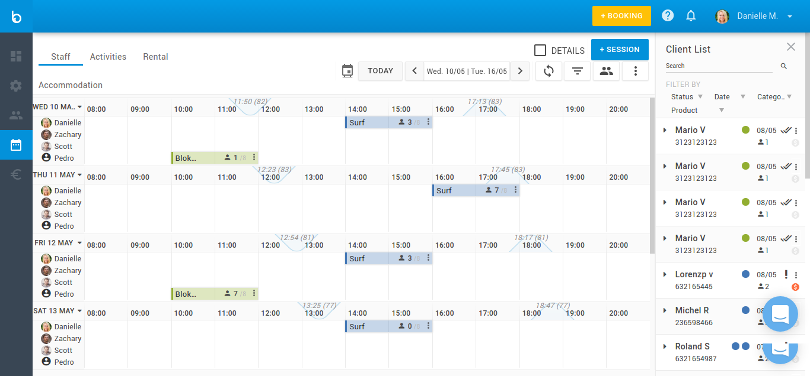
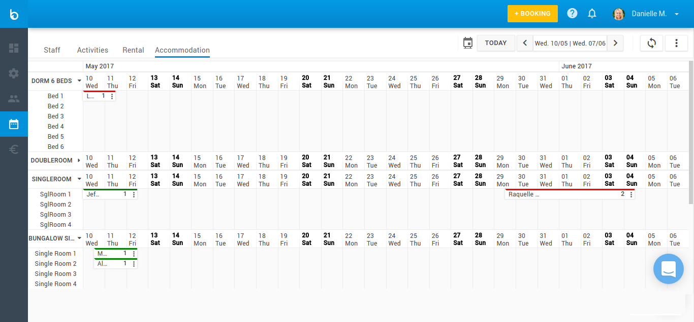
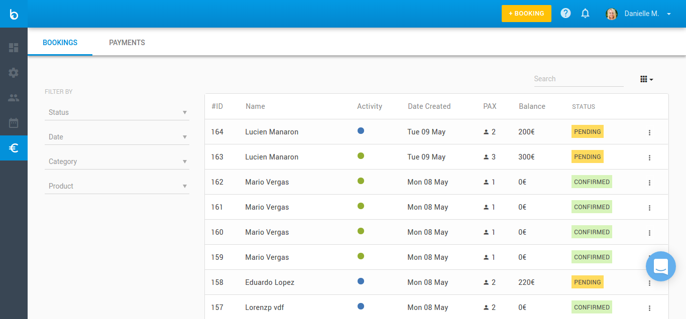
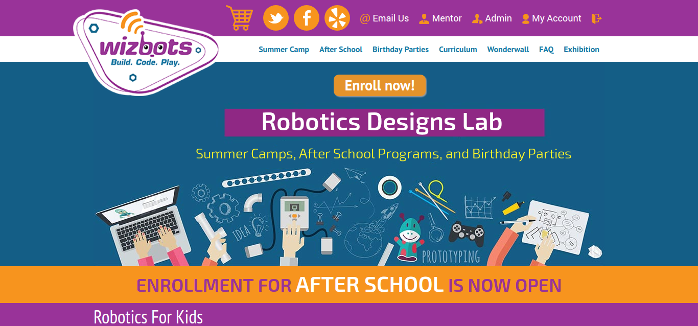
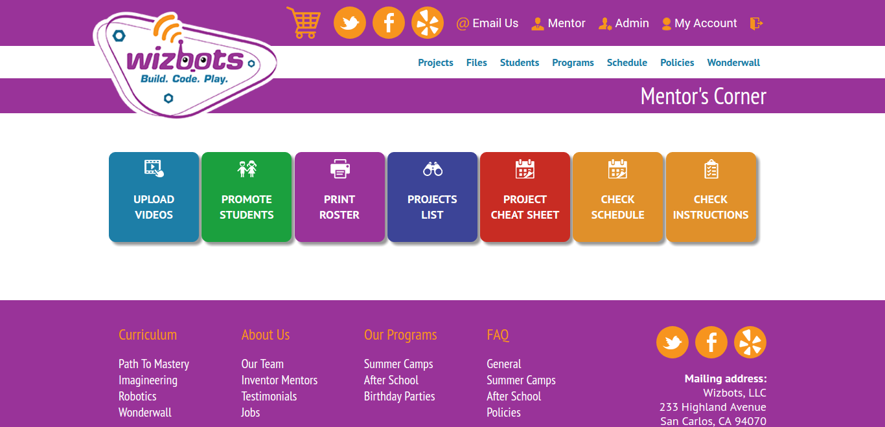
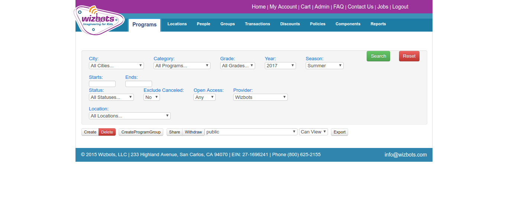
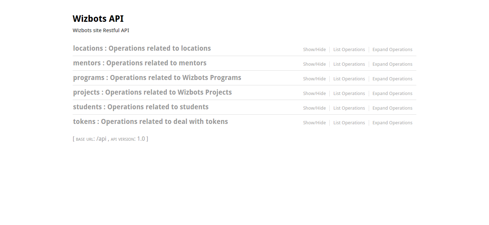
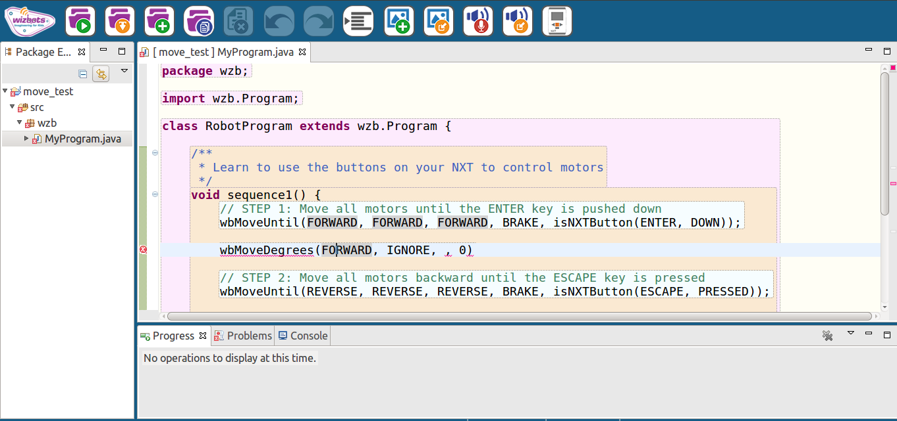

<!-- .slide: data-state="no-toc-progress" --> <!-- don't show toc progress bar on this slide -->

# ALEJANDRO VILLAMARIN
<!-- .element: class="no-toc-progress" --> <!-- slide not in toc progress bar -->

## A Software Craftsman with a curious mind striving to improve every day

Updated 2017-05-09 | [Linkeidn] [1] | [Github] [2] | [StackOverflow] [3] | [Personal Site] [4]

[1]: https://linkedin.com/in/avillamarin
[2]: https://github.com/internetmosquito
[3]: http://stackoverflow.com/cv/alejandrovk
[4]: http://internetmosquito.com

----  ----

# Working experience

----

## CTO & Co-founder at OpenCoast

* **Feb 2014 - Present**
* Built from the ground-up a planning and management application for watersports schools
[Bloowatch][7] which is currently being used by hundreds of customers, in a growing pace
* Worked as the CTO in the Open Coast Company and singlehanded managed all the operations
from DevOps to front-end to back-end development, data modeling and Architecting process.
Conveying from using Java as the main backbone of our technology stack (Spring.io, Ant, Maven,
Hadoop) to a more "modern" Pythonic one (Flask- Django) that is currently being used
* Streamline work and focus on tasks relate with project management which include Scrum and Agile
methodologies
* Successfully coded new Java code, Python (Django-Flask), Postgres (POSTGIS), MongoDB, REDIS),
Celery, used Docker and Ansible for CI & CD (used Vagrant and Chef in the past), Ember as the
Javascript framework, HTML5 & CSS3 & Bootstrap, played a fundamental part for this project with a hands-on apparoch

[7]: https://bloowatch.com

----

## Director of Engineering at Wizbots

* **Sept 2016 - Present**
* As a Principal Member of Technical Staff had to own the software design and development for
major components of [Wizbots][8] platform
* Dive deep into any part of the stack and low level systems, as well as design broad
distributed system interactions
* Defined and participated in the technological roadmap to align with business goals, taking into
consideration budget restrictions, schedules and remote team of developers

[8]: https://wizbots.com

----

## FullStack developer for Big Data Analytics and Workflow Optimization Product at Genesys

* **Feb 2014 - Apr 2015**
* Worked sometime as a Full Stack Python developer using an interesting range of technologies:
Javascript, jQuery, Angular in the front-end and Python Flask in the back-end
* Participated in the evolution and maintenance of a Social Media Big Data Platform, [SocialOptmizr][9], bug fixing and working on new features.

[9]: http://www.crunchbase.com/organization/socialoptimizr#/entity

----

## R&D Engineer at Tecnalia

* **Jan 2010 - Feb 2014**
* Established strategic alliance in mid-east and honorably received appreciation in Cairo, Egypt for
the variability management tool named PLUM, an in-house development
* Developed of an in-house middleware solution based on OSGI and Eclipse called [Smool][10], allowed end users to create rich content requests using all the sensor available at hand as well as acknowledge gratitude and obtain new projects and funding through this project
* Directed all functions and activities associated with multi-departmental matrix teams to meet
project requirements. Plan, organise and execute core phases of technology projects which
included cloud based apps using services like Java, Eclipse, OSGI, RDF, Ontologies

[10]: www.tecnalia.com/es/ict-european-software-institute/oportunidades-de-negocio/oportunidades-de-
negocio.htm

----

## R&D Engineer at European Software Institute

* **Spet 2007 - Jan 2010**
* Developed and structured legacy system such as software product line product (GNSIS) and
handled meeting scheduling tool (Meeting Space) using VBasic and C++ also started to work in
European and national R&D
* Fostered congenial relations with multiple personnel including an individual sub contracted by
NASA in WV USA and derived substantial revenue by closely working with [NASA][11]
* Functioned with European and national R&D projects, as well as spearheaded management of a
virtualisation infrastructure used to serve several in-house services: SVN, FTP, Web servers, etc

[11]: http://www.europapress.es/euskadi/noticia-esi-tecnalia-firma-contrato-nasa-demostrar-eficacia-actividades-produccion-software-20070419154757.html

----  ----

# Projects

----

## Bloowatch

* A waterposts management tool for Watersports Schools
* Manage roster, agenda, customers, courses, accommodation and bookings, all in a single place
* Online booking features integrated in School's websites
* Tech Stack: Python, Django, Postgres, Celery, Ember, Docker, Ansible.
* **Responsabilities**: Architecture definition, Data model definition, hands-on development, team management and leadership, Scrum Master, QA. 

----

###  Bloowatch Screenshots

----

###  Bloowatch Screenshots

----

###  Bloowatch Screenshots

----

###  Bloowatch Screenshots

----

###  Bloowatch Screenshots

----

###  Bloowatch Screenshots

----

## Wizbots

* Wizbots is a learning platform for kids to learn programming and Robotics
* Kids learn fundamentals of programming with Java and Robotics with LEGO
* Fosters teamwork and learning of new abilities
* Tech Stack: Python, Flask, Postgres, ElasticSearch, Angular, Eclipse, Java.
* **Responsabilities**: Roadmap planning, hands-on development, API implmentation, team management and leadership.

----

###  Wizbots Screenshots

----

###  Wizbots Screenshots

----

###  Wizbots Screenshots

----

###  Wizbots Screenshots

----

###  Wizbots Screenshots

----  ----

# About me

----

## Education and certifications

* Master's Degree in Computer Science, University of Deusto, 2006

* Certificate in Advanced Studies, University of Deusto, 2009

## Areas of interest

Software Engineering | Application Development | Technical Troubleshooting | Team Leadership | Scrum |
Python | Javascript | Linux | Java | Testing methodologies

## Technology proficiencies

Python | Django | Flask | Ember | Angular | Eclipse | Java | Android | REST | R&D | Open Source | Middleware | XML | Git | Scrum | OOP | Embedded Software | MongoDB | JavaScript | OSGI | Linux | Docker | Hadoop | Hive

----

## Contact info

* [Email][12]
* [Twitter][13]
* [Skype][14] 
* Phone: 0034 - 637 14 92 58

[12]: mailto:alejandrovillamarin@internetmosquito.com
[13]: https://twitter.com/avillamarink
[14]: skype:alejandrovillamarin?add

----  ----

<!-- .slide: data-state="no-toc-progress" --> <!-- don't show toc progress bar on this slide -->

### *Thanks for your interest!*
<!-- .element: class="no-toc-progress" -->

